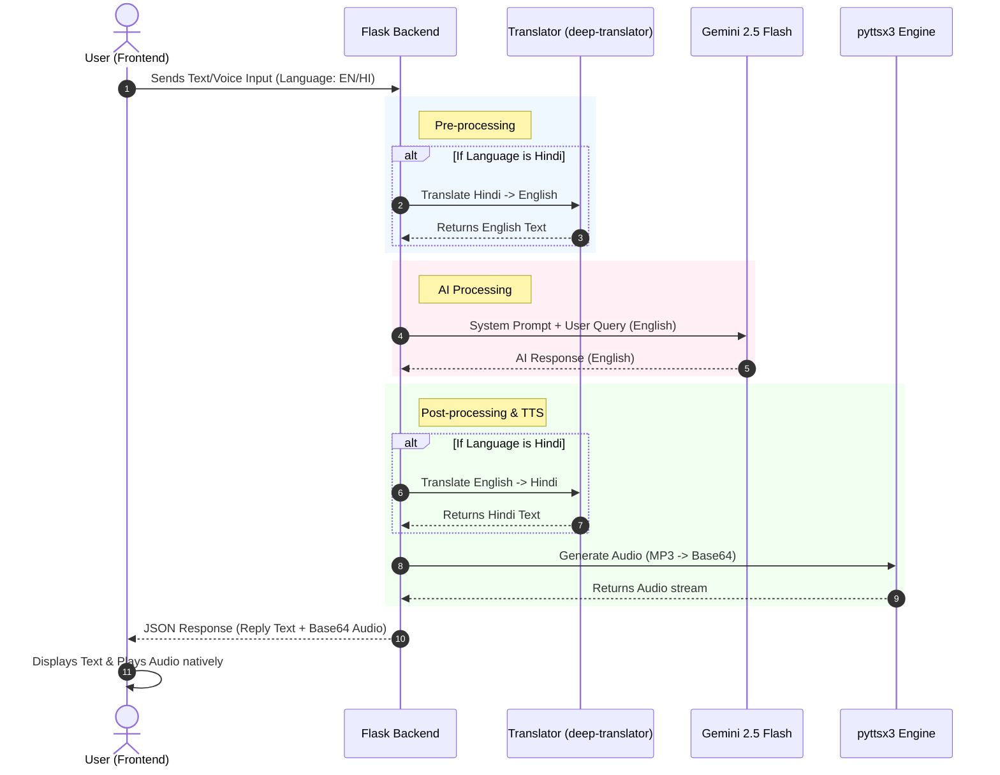

# 🛠️ Blue Collar Assistant

A highly interactive, AI-powered voice and text assistant tailored for blue-collar workers. It provides short, clear, and friendly answers about skills, jobs, and career guidance, supporting both English and Hindi.

## 🚀 Features
- 🤖 **AI-Powered Answers**: Uses Gemini 2.5 Flash for fast and smart responses.
- 🗣️ **Voice Interaction**: Built-in Text-to-Speech (TTS) and Speech-to-Text via browser APIs.
- 🌍 **Bilingual Support**: Real-time translation between English and Hindi.
- 💬 **Interactive Chat UI**: A floating, responsive widget for a seamless user experience.

---

## 🏗️ Tech Stack

### Backend
- **Python (Flask)**: Serves the REST API and static frontend files.
- **Google Generative AI**: Gemini 2.5 Flash model for generating conversational responses.
- **pyttsx3**: For generating Text-to-Speech audio locally in a thread-safe manner.
- **deep-translator**: Translates Hindi to English for the AI, and English back to Hindi for the user.

### Frontend
- **HTML/CSS/JS (Vanilla)**: A lightweight, responsive chat interface without heavy frameworks.
- **Web Speech API**: In-browser speech recognition for native voice input.

---

## 📂 Project Structure

```text
Blue_collar_assistant/
│
├── assistant.py          # Main Flask application, AI integration, and TTS logic
├── index.html            # Frontend UI (Floating chat widget, JS logic)
├── requirements.txt      # Python dependencies
├── assistant_icon.png    # Icon for the chat widget
├── .env                  # Environment variables (API Key, Port)
└── venv/                 # Python Virtual Environment
```

---

## 📊 Interactive Architecture Diagram

Here is a visual representation of the data flow and how the Blue Collar Assistant processes a user's request:



---

## ⚙️ Setup & Installation

1. **Navigate to the project directory**:
   ```bash
   cd Blue_collar_assistant
   ```

2. **Create and activate a virtual environment**:
   ```bash
   python -m venv venv
   # On Windows:
   venv\Scripts\activate
   # On macOS/Linux:
   source venv/bin/activate
   ```

3. **Install Dependencies**:
   ```bash
   pip install -r requirements.txt
   ```

4. **Set up Environment Variables**:
   Make sure you have a `.env` file in the root directory and add your Gemini API Key:
   ```env
   GEMINI_API_KEY=your_google_gemini_api_key_here
   PORT=5000
   ```

5. **Run the Application**:
   ```bash
   python assistant.py
   ```
   *The script will automatically open your default web browser to `http://127.0.0.1:5000/`.*
